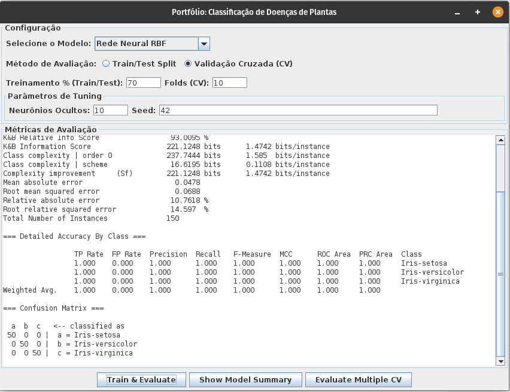
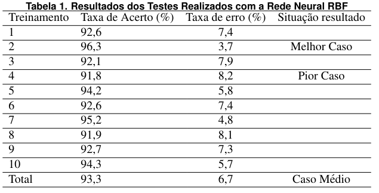

# Utilizando a Rede Neural RBF Como Mecanismo Auxiliador no Diagnóstico da Doença da Murcha Fitóftora em Pimentões

## 📜 Artigo
[🔗 Acesse o artigo completo aqui](https://doi.org/10.5753/ercemapi.2020.11466)

## 📌 Visão Geral
Este repositório apresenta a implementação do estudo que utiliza a Rede Neural Radial Basis Function (RBF) para auxiliar no pré-diagnóstico da doença murcha de fitóftora em pimentões. O projeto foi desenvolvido utilizando **Java e a biblioteca WEKA**.

## 📄 Resumo
A utilização de técnicas de Inteligência Artificial tem se destacado na resolução de diversas problemáticas. Este estudo investiga o uso da rede neural RBF como ferramenta de suporte no pré-diagnóstico da murcha de fitóftora em uma horta de pimentões. A metodologia foi implementada utilizando uma base de dados de imagens, com ênfase no treinamento e teste para classificação das amostras. Foram realizados 10 treinamentos com os dados normalizados e balanceados, aplicando validação cruzada (k-fold). A análise estatística revelou uma taxa média de acertos de **93,3%**.

## 🛠 Tecnologias Utilizadas
- **Java SE 8**
- **WEKA**
- **Interface gráfica em Java Swing**
- **Validação Cruzada (k-fold)**

## 📂 Base de Dados
A base de dados utilizada no estudo **não está inclusa neste repositório**. No entanto, a versão pré-anotação dos dados está disponível para referência e experimentação.

## 📸 Demonstração

---
🚀 **Este projeto faz parte do meu portfólio. Fique à vontade para explorar e contribuir!**

